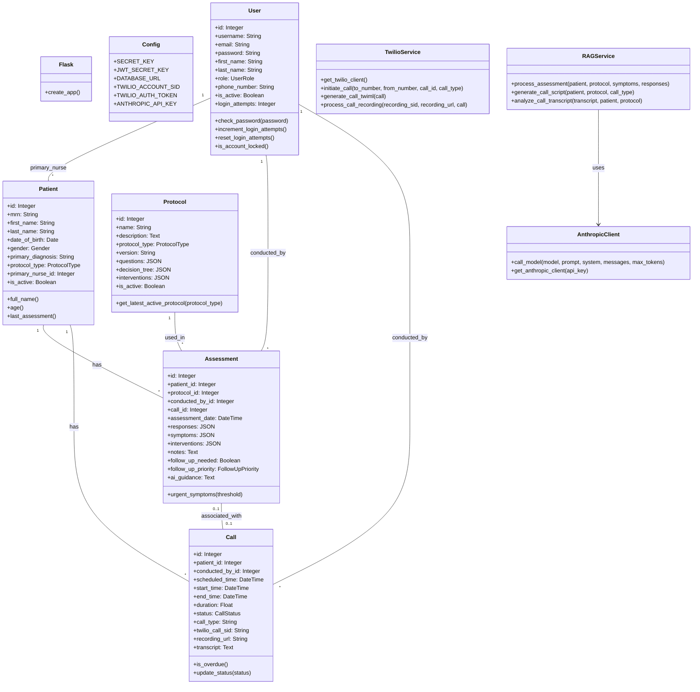

SteadywellOS is a comprehensive platform designed for palliative care coordination and remote patient management. It enables healthcare providers to efficiently manage patient assessments, schedule follow-up calls, and implement specialized care protocols for conditions like cancer, heart failure, and COPD.

## 🏛️ System Architecture



## 🚀 Quick Start

SteadywellOS can be set up and run using the Just command runner or directly using the shell scripts in the `scripts` directory.

### Prerequisites

- [Docker](https://docs.docker.com/get-docker/) and [Docker Compose](https://docs.docker.com/compose/install/)
- [Just](https://github.com/casey/just#installation) (optional but recommended)
- [1Password CLI](https://developer.1password.com/docs/cli/get-started/) (optional but recommended 1Password secret references)

### Installation Steps

#### Step 1: Set up environment variables

If using just

```bash
cp .env.example .env.secrets
```

If you're going to run scripts manually without just you'll also want to copy `.env.secrets` into `.env`

```bash
cp .env.secrets .env
```

#### Step 2: Install dependencies

**Option 1: Using Just (recommended)**

```bash
# Install dependencies using the just command
just install
```

**Option 2: Manual installation**

```bash
# Install uv (if not already installed)
pip install uv

# Create a virtual environment using uv
uv venv .venv

# Activate the virtual environment
# On Windows:
.venv\Scripts\activate
# On macOS/Linux:
source .venv/bin/activate

# Install dependencies using uv
uv pip install -r requirements.txt
```

This will:

- Set up a Python virtual environment in the .venv directory
- Install all required dependencies using uv
- Prepare the environment for running the application

**Option 3: PyCharm Setup**

If you're using PyCharm as your IDE, you can configure it to use the local `.venv` virtual environment:

1. See the detailed instructions in [docs/pycharm_setup.md](docs/pycharm_setup.md)
2. This will ensure PyCharm uses the correct Python interpreter and dependencies

#### Step 3: Start the application

```bash
# Using Just (recommended)
just up

# Or using the script directly
./scripts/up.sh
```

This will:

- Build and start all necessary containers
- Configure the application environment
- Make the application available at http://localhost:8080

#### Step 3: Initialize and seed the database

The database is automatically initialized during startup, but you can also do it manually:

```bash
# Using Just
just db-init   # Initialize database schema
just db-seed   # Seed with sample data

# Or using scripts directly
./scripts/db_init.sh
./scripts/db_seed.sh
```

After completing these steps, the platform will be available at http://localhost:8080

## 🔑 Default Login Credentials

The system is seeded with the following test users:

- **Admin**

  - Username: `admin`
  - Password: `password123`

- **Nurse**

  - Username: `nurse1`
  - Password: `password123`

- **Physician**
  - Username: `physician`
  - Password: `password123`

**IMPORTANT:** These are default test credentials. In a production environment, you must change these passwords.

## 📁 Project Structure

The project is organized into the following directories:

- `app/` - Main application code
  - `api/` - API endpoints and routes
  - `models/` - Database models
  - `schemas/` - Pydantic schemas for validation
  - `services/` - Business logic and external services
  - `static/` - Static assets (CSS, JS)
  - `templates/` - HTML templates
  - `utils/` - Utility functions
- `config/` - Configuration files
- `data/` - Data files and backups
- `docs/` - Documentation files
- `logs/` - Log files
- `scripts/` - Utility scripts
  - `obsolete/` - Deprecated scripts
- `tests/` - Test files

## 🧰 Key Scripts

| Script                            | Purpose                               | When to Use                         |
| --------------------------------- | ------------------------------------- | ----------------------------------- |
| `scripts/install.sh`              | Initial setup and dependency checks   | First-time setup                    |
| `scripts/up.sh`                   | Start application containers          | Starting the application            |
| `scripts/down.sh`                 | Stop application containers           | Shutting down the application       |
| `scripts/db_reset.sh`             | Reset database to clean state         | When database is corrupted          |
| `scripts/db_seed.sh`              | Populate database with sample data    | After database initialization       |
| `scripts/db_backup.sh`            | Create database backups               | Before changes or regularly         |
| `scripts/db_reset_from_backup.sh` | Restore database from backup          | After failure or to revert changes  |
| `scripts/protocol_ingest.py`      | Initialize clinical protocols         | During setup or updating protocols  |
| `scripts/upgrade_anthropic.sh`    | Update Anthropic library              | When API compatibility issues arise |
| `scripts/push_to_dockerhub.sh`    | Build and push container to DockerHub | When deploying new versions         |
| `scripts/push_to_quome.sh`        | Deploy container to Quome             | When deploying to production        |
| `run.py`                          | Main application entry point          | Various database operations         |

## 🛠️ Available Commands

The following commands are available through the Just command runner:

| Command                  | Description                                                      |
| ------------------------ | ---------------------------------------------------------------- |
| `just up`                | Start the application                                            |
| `just down`              | Stop the application                                             |
| `just restart`           | Restart the application                                          |
| `just logs`              | View application logs                                            |
| `just db-init`           | Initialize the database (delete, initialize, then seed)          |
| `just db-seed`           | Seed the database with sample data                               |
| `just db-reset`          | Reset the database (drop, create, seed)                          |
| `just protocols [type]`  | Initialize protocols (type: cancer, heart_failure, copd, or all) |
| `just status`            | Check application status                                         |
| `just test`              | Run tests                                                        |
| `just test-http`         | Run HTTP-based tests (no browser dependencies)                   |
| `just test-ui`           | Run UI tests without Selenium                                    |
| `just test-dates`        | Run tests for date handling                                      |
| `just test-autologout`   | Run auto-logout tests                                            |
| `just test-all`          | Run all tests in sequence                                        |
| `just build`             | Build the Docker container                                       |
| `just push-to-dockerhub` | Build and push the Docker container to DockerHub                 |
| `just push-to-quome`     | Pull the Docker container and push to Quome                      |
| `just install`           | Install dependencies                                             |

### Protocol Initialization

The system includes specialized care protocols for different conditions:

```bash
# Initialize all protocol types
just protocols

# Initialize a specific protocol type
just protocols cancer
just protocols heart_failure
just protocols copd
```

Each protocol includes:

- Structured assessment questions
- Recommended interventions based on symptoms
- Decision tree logic for determining appropriate care actions

## ✨ Features

- **Secure Authentication**: Role-based access control with secure login for healthcare providers
- **Protocol-Based Care**: Specialized protocols for cancer, heart failure, and COPD patients
- **Telephony Integration**: Automated calls, voice assessments, and transcription via Twilio
- **AI-Powered Guidance**: Uses RAG models to analyze patient information and suggest interventions
- **HIPAA-Compliant**: Secure handling of sensitive patient data with audit logging
- **Comprehensive Dashboard**: Real-time overview of patient status and upcoming tasks

## 🔧 Technology Stack

- **Backend**: Python 3.10 with Flask framework
- **Database**: PostgreSQL with SQLAlchemy ORM
- **Frontend**: HTML/CSS/JavaScript with Bootstrap 5
- **API**: RESTful API with JWT authentication
- **AI Integration**: Anthropic Claude for protocol guidance
- **Telephony**: Twilio API for voice calls and transcription
- **Deployment**: Docker containerization

## 🔐 Environment Variables

Key environment variables to configure:

- `FLASK_APP`: Set to `run.py`
- `FLASK_ENV`: Set to `development` or `production`
- `SECRET_KEY`: Application secret key for security
- `DATABASE_URL`: PostgreSQL connection string
- `ANTHROPIC_API_KEY`: API key for Claude AI integration
- `TWILIO_ACCOUNT_SID`: Twilio account SID for telephony
- `TWILIO_AUTH_TOKEN`: Twilio authentication token
- `TWILIO_PHONE_NUMBER`: Twilio phone number for outgoing calls

## 📡 API Documentation

The application provides a RESTful API with the following main endpoints:

- `POST /api/v1/auth/login`: Authenticate and receive JWT token
- `GET /api/v1/patients`: List all patients
- `GET /api/v1/patients/:id`: Get patient details
- `POST /api/v1/calls`: Schedule a new call
- `POST /api/v1/assessments`: Create a new patient assessment

Refer to the full API documentation in the `/docs` directory.

## 📋 Protocols

SteadwellOS comes with three specialized protocols:

1. **Cancer Palliative Care Protocol**: Pain management, nausea control, and fatigue assessments
2. **Heart Failure Protocol**: Dyspnea, edema, and activity tolerance evaluations
3. **COPD Protocol**: Respiratory symptoms, oxygen use, and breathing technique assessments

Each protocol includes:

- Structured question sets for telephone assessments
- Severity rating systems for symptoms
- Decision tree algorithms for intervention recommendations
- Educational materials for patients and caregivers

## 👨‍💻 Development

To modify the platform:

1. Stop the containers: `docker-compose down`
2. Make your changes
3. Rebuild and restart: `docker-compose up -d --build`

## 📄 License

This project is licensed under the MIT License—see the LICENSE file for details.

## 🙏 Acknowledgments

- Palliative care specialists who provided domain expertise
- Telephone triage protocol references
- Anthropic for AI capabilities
- Twilio for telephony integration
