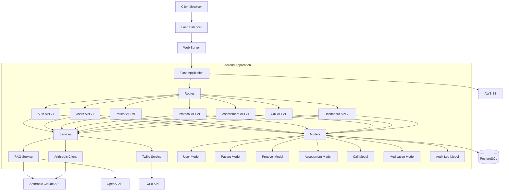

# SteadywellOS - Architecture Overview

This document provides a comprehensive overview of the SteadywellOS Palliative Care Platform architecture.

## System Architecture

## Component Details

### Frontend
- HTML, CSS, Bootstrap-based responsive interface
- JavaScript for dynamic interactions
- Rendered templates for views (dashboard, patients, calls, assessments)

### Backend
- Python 3.10 with Flask framework
- RESTful API design with modular components
- Flask extensions: Flask-SQLAlchemy, Flask-Migrate, Flask-Marshmallow, Flask-Bcrypt, Flask-JWT-Extended
- JWT-based authentication system
- Role-based access control
- Blueprint-based API organization

### Database
- PostgreSQL database
- SQLAlchemy ORM for database interactions
- Models for users, patients, protocols, assessments, calls, medications, and audit logs
- Database migrations using Flask-Migrate

### External Services
- Twilio API for telephony integration (calls, SMS, recordings)
- Anthropic Claude API for protocol guidance and RAG capabilities
- OpenAI API as an alternative for RAG capabilities
- AWS S3 for file storage
- SMTP for email notifications

### Security Features
- JWT authentication
- Role-based authorization
- Secure password hashing
- Audit logging of system activities
- HTTPS for all communications

## Data Flow

1. Users authenticate through the web interface
2. User actions trigger API requests to the backend
3. Backend processes requests through appropriate controllers
4. Database operations performed via models
5. External services accessed through service layers
6. Results returned to users through the web interface

## API Structure

The API is organized around resources with versioning (v1):
- `/api/v1/auth`: Authentication endpoints
- `/api/v1/users`: User management
- `/api/v1/patients`: Patient management
- `/api/v1/protocols`: Protocol definitions and management
- `/api/v1/assessments`: Patient assessments
- `/api/v1/calls`: Call scheduling and management
- `/api/v1/dashboard`: Dashboard data aggregation

## Deployment

The application is containerized using Docker with:
- Application container running Flask
- PostgreSQL database container
- Docker Compose for orchestration
- Volume mounting for persistent data storage

## Scaling Considerations

- Horizontal scaling of application containers
- Database read replicas for scaling read operations
- In-memory caching for frequently accessed data
- Background task processing for asynchronous operations

## Future Enhancements

- Advanced caching for improved performance
- Distributed rate limiting
- Message queue for background task processing
