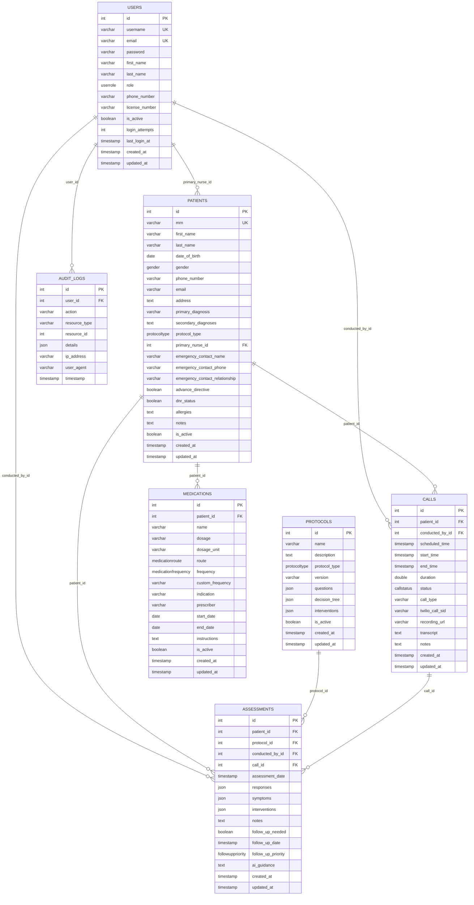

# SteadwellOS Palliative Care Database Schema

## Entity Relationship Diagram

## Key Relationships

### 1. **Users to Patients** (One-to-Many)
- Each patient has one primary nurse
- Each nurse can be assigned to multiple patients
- **FK**: `patients.primary_nurse_id` → `users.id`

### 2. **Patients to Calls** (One-to-Many)
- Each patient can have multiple calls
- Each call belongs to one patient
- **FK**: `calls.patient_id` → `patients.id`

### 3. **Users to Calls** (One-to-Many)
- Each call is conducted by one user (nurse)
- Each user can conduct multiple calls
- **FK**: `calls.conducted_by_id` → `users.id`

### 4. **Patients to Assessments** (One-to-Many)
- Each patient can have multiple assessments
- Each assessment belongs to one patient
- **FK**: `assessments.patient_id` → `patients.id`

### 5. **Protocols to Assessments** (One-to-Many)
- Each assessment uses one protocol
- Each protocol can be used in multiple assessments
- **FK**: `assessments.protocol_id` → `protocols.id`

### 6. **Users to Assessments** (One-to-Many)
- Each assessment is conducted by one user
- Each user can conduct multiple assessments
- **FK**: `assessments.conducted_by_id` → `users.id`

### 7. **Calls to Assessments** (One-to-Many)
- Each assessment can optionally be linked to a call
- Each call can have multiple assessments
- **FK**: `assessments.call_id` → `calls.id`

### 8. **Patients to Medications** (One-to-Many)
- Each patient can have multiple medications
- Each medication belongs to one patient
- **FK**: `medications.patient_id` → `patients.id`

### 9. **Users to Audit Logs** (One-to-Many)
- Each audit log entry is created by one user
- Each user can have multiple audit log entries
- **FK**: `audit_logs.user_id` → `users.id`

## Enum Types

### UserRole
- `nurse`
- `administrator`
- `patient`

### Gender
- `male`
- `female`
- `other`

### ProtocolType
- `cancer`
- `heart_failure`
- `copd`
- `general`

### CallStatus
- `scheduled`
- `in_progress`
- `completed`
- `missed`
- `cancelled`

### FollowUpPriority
- `low`
- `medium`
- `high`
- `urgent`

### MedicationRoute
- `oral`
- `iv`
- `im`
- `sc`
- `topical`
- `inhalation`
- `other`

### MedicationFrequency
- `once_daily`
- `twice_daily`
- `three_times_daily`
- `four_times_daily`
- `as_needed`
- `custom`

## Data Flow

1. **Patient Registration**: Patients are created and assigned to a primary nurse
2. **Protocol Selection**: Based on patient's condition, appropriate protocols are selected
3. **Call Scheduling**: Calls are scheduled for patient check-ins
4. **Assessment Execution**: During calls, assessments are conducted using protocols
5. **Medication Management**: Patient medications are tracked and managed
6. **Audit Trail**: All actions are logged in audit_logs for compliance

## JSON Fields

### Assessments
- **responses**: Patient responses to protocol questions
- **symptoms**: Recorded symptoms with severity scores
- **interventions**: Recommended actions and interventions

### Protocols
- **questions**: Assessment questions for the protocol
- **decision_tree**: Logic for determining next steps
- **interventions**: Available interventions for the protocol

### Audit Logs
- **details**: Additional context about the logged action